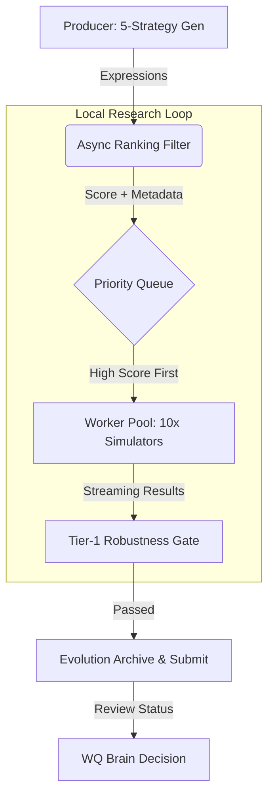

# 🚀 Alpha Factory: High-Performance Research Engine

Production-grade alpha generation pipeline for WorldQuant Brain. Engineered for high-throughput discovery using **Async Streaming Architecture**, **Priority-Based Scheduling**, and **Quality-Diversity (QD) Evolution**.

> **Security:** This is a private quantitative research repository. Never expose alpha expressions, alpha IDs, raw WQ API payloads, or credentials.

---

## 🏗️ Architecture: Async Streaming & Priority Search

The engine has shifted from naive batch processing to a **True Async Streaming** model with prioritized task execution.



### ⚡ Pipeline Intelligence

| Stage | Mechanism | Impact |
|-------|-----------|--------|
| **Generator** | **Advanced RAG & DNA Mutation** | Mutates "Elite Seeds" using quantitative hypotheses (e.g., Price Intensity, Illiquidity Clustering). |
| **Ranker** | **Fast 5-Layer Filter** | Discards duplicates and low-potential alphas locally. Zero WQ API cost. |
| **Priority Queue** | **`asyncio.PriorityQueue`** | High-potential alphas (`pre_rank` score) are simulated first, maximizing "Gold-to-Waste" ratio. |
| **Simulator** | **Independent Workers** | 10 async workers processing individual alphas. **Staggered Start** prevents API burst limits. |
| **Robustness Gate** | **Multi-Tier Policy** | Local checks for **Survivorship Bias**, **Lookahead Bias**, **IC Stability**, and **Drawdown Penalty**. |
| **Evolution** | **MAP-Elites Archive** | Successful results update the DNA seed pool, creating a self-improving feedback loop. |

---

## 🛠️ Setup & Operation

### 1. Bootstrap
```bash
python alpha_factory_cli.py setup
```
Installs dependencies into a local `.venv` and initializes the SQLite tracking DB.

### 2. Configure Credentials
Edit `.env` (ensure `WQ_EMAIL` and `WQ_PASSWORD` are set).
**Elite Mode Configuration:**
```env
ASYNC_SIMULATOR_WORKERS=10    # Max concurrency for WQ Brain
ASYNC_BATCH_SIZE=1           # Enable streaming mode
ASYNC_SIM_BATCH_TIMEOUT=400   # Handle complex alpha backtests
WQ_POLL_INTERVAL=5           # Faster stage response detection
```

### 3. Execution (The "Auto" Mode)
To start the high-throughput pipeline:
```bash
python alpha_factory_cli.py auto
```

> [!IMPORTANT]
> **Migration Note:** If you were previously running the Batch-based version, you MUST kill all zombie processes to clear the WQ simulation slots:
> `taskkill /F /IM python.exe` (Windows)

---

## ⚖️ Quality Policy (Tier-1 Gate)

We simulate locally what WQ Brain checks in review to save time and quota.

### Robustness Checks
- **IC Stability**: Checks if the performance ratio (Fitness/Sharpe) is consistent.
- **Drawdown Guard**: Penalizes alphas with > 5% drawdown; rewards smooth return curves.
- **Bias Detection**: RegEx-based detection for raw price leakage (Survivorship) and future data peeking (Lookahead).
- **Sub-Universe Alignment**: Alphas must show robustness across diverse stock pools.

### Strategy Clusters
1. **LLM/RAG**: Hypothesis-driven mutation of proven seeds.
2. **Evolved**: Direct crossover and structural mutation of successful ancestors.
3. **RareOps**: Exploration of high-complexity operators (Hump, Trade_When, etc.).
4. **Deterministic**: Pattern-based discovery and template filling.

---

## 📊 Monitoring & Performance

### Live KPIs
While the pipeline is running, use a second terminal:
```bash
python alpha_factory_cli.py kpi --minutes 60
```
- **`gate_pass_rate`**: Efficiency of the generator in creating robust alphas.
- **`true_accept_rate`**: The ultimate metric — percentage of alphas accepted for payment.

### Troubleshooting
- **Simulation Timeout**: If you see `⏰ Timeout`, check if the alpha is too complex or increase `ASYNC_SIM_BATCH_TIMEOUT`.
- **Slot Full (429)**: The system automatically triggers a **60s Backoff** to let the WQ Brain API cool down.

---

## 🧪 Testing
```bash
# Run the full 60+ test suite
.venv\Scripts\python.exe -m pytest tests/ -q
```

---
*Developed for elite quantitative research. Private & Confidential.*
